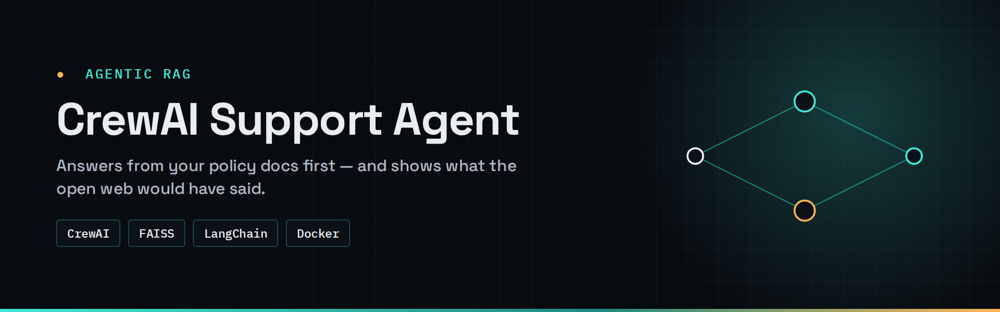
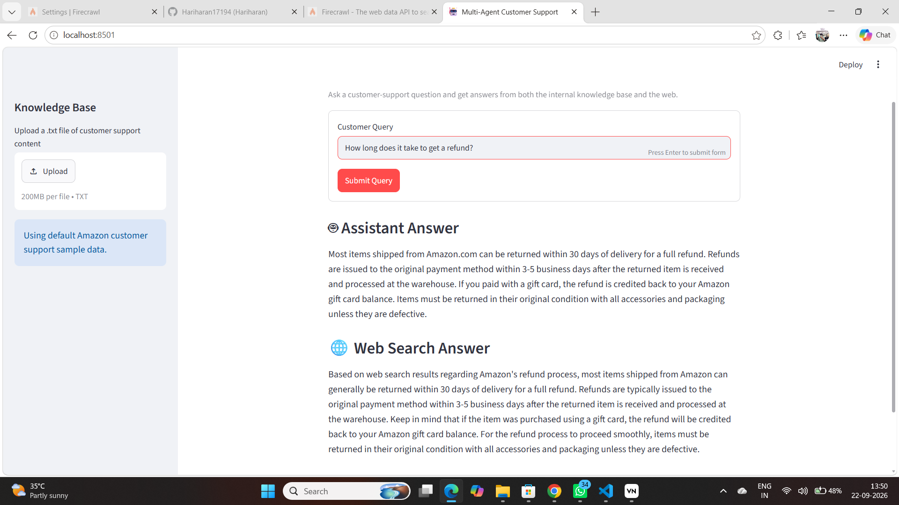
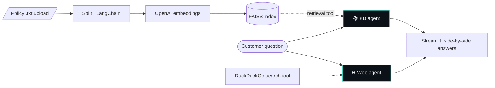

<div align="center">



# CrewAI Support Agent

**An e-commerce support assistant that answers from your policy docs first — and shows you what the open web would have said.**

[](https://github.com/Hariharan17194/crewai-support-agent/actions/workflows/ci.yml)


[](LICENSE)

</div>

---

## ✦ Why this exists

Support bots that rely only on web search give confident, *generic* answers that contradict your actual policy. Bots that rely only on internal docs go silent on anything new. This project runs **both** — a knowledge-base agent and a web-search agent — so you can see where your docs have gaps.

## ✦ Demo



## ✦ How it works



| Mode | Entry point | Behaviour |
|---|---|---|
| **Web UI** | `app.py` | Two agents in parallel — KB-only vs web-only, shown side by side |
| **CLI** | `Customer_support.py` | One agent: KB first, web fallback, single combined answer |

## ✦ Quick start

**Docker**

```bash
git clone https://github.com/Hariharan17194/crewai-support-agent.git
cd crewai-support-agent
cp .env.example .env          # OPENAI_API_KEY=...
docker compose up --build     # → http://localhost:8502
```

**Local**

```bash
python -m venv .venv && .venv\Scripts\activate        # macOS/Linux: source .venv/bin/activate
pip install -r requirements.txt
streamlit run app.py          # or: python Customer_support.py
```

A sample knowledge base ships in `data/amazon_customer_support.txt` — or upload your own `.txt` from the sidebar.

## ✦ Project structure

```text
├── support_core.py        # RAG index, tools, agent definitions (shared)
├── app.py                 # Streamlit UI (parallel agents)
├── Customer_support.py    # CLI entry point (KB → web fallback)
├── data/                  # sample knowledge base
├── Dockerfile · docker-compose.yml
└── requirements.txt
```

## ✦ Design decisions

- **Parallel agents in the UI, fallback in the CLI** — the UI is for *comparing* sources; the CLI is how a real support flow would behave.
- **FAISS in-memory** — rebuilt per upload; fine for small policy sets, swap for a persistent store for large corpora.

## ✦ Roadmap

- [ ] Pin dependency versions and add a lock file
- [ ] PDF/Markdown ingestion
- [ ] Answer-agreement score between KB and web answers (flag doc gaps automatically)

## ✦ License

[MIT](LICENSE) © 2026 Hariharan Padmanabhan
